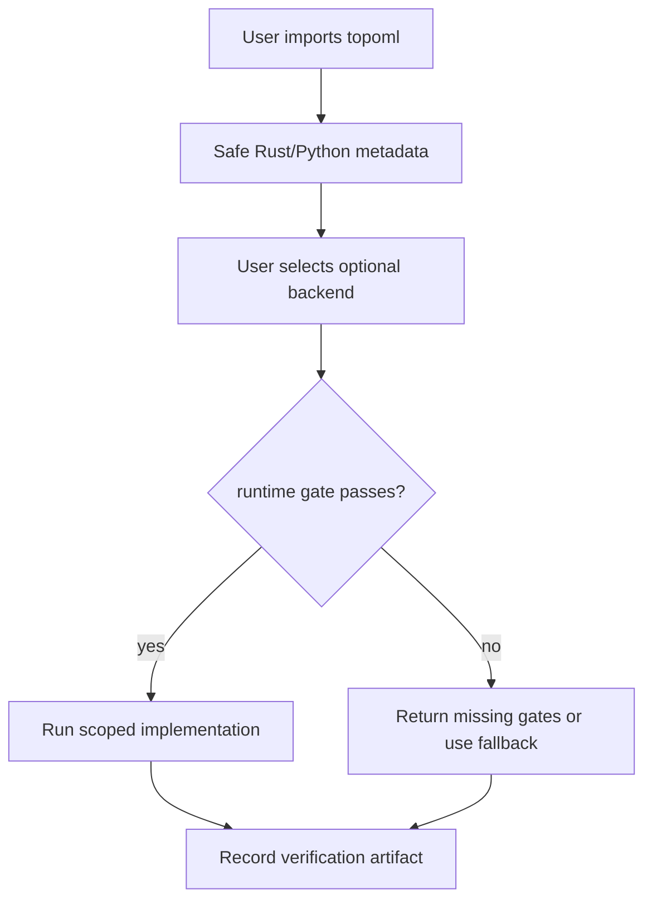

# Backend Compatibility

Compatibility means a user can tell what code exists, what runtime gate must
pass, what fallback applies, and what verification command supports the claim.

| Backend | Status | Runtime gate | Fallback | Verification | Claim boundary |
| --- | --- | --- | --- | --- | --- |
| Safe Rust | Active | Rust toolchain for crate tests | None needed; this is the correctness source | `cargo test -p topoml-core` | Bounded exact Vietoris-Rips PH for supported dimensions and caps |
| Python reference | Active | Python plus NumPy | Safe public API path | `python -m pytest python/tests -q` | Data-science API, feature encoders, graphs, diagnostics, and dashboards |
| C++ | Active optional | C++ compiler and shared-library load | Python/Rust reference path | `python -m pytest python/tests/test_cpp_native_ctypes.py -q` | Pairwise distance, threshold edges, and H0 barcode C ABI |
| ASM AVX-512 | Active optional | Linux x86-64, CPUID, XCR0, compiler | Scalar ASM or Python distance path | `python -m pytest python/tests/test_asm_native_ctypes.py -q` | L2-squared dispatch only; not full PH reduction |
| CUDA | Active optional | `nvcc`, host compiler, CUDA runtime, CUDA device | NumPy/Python distance and threshold path | `python -m pytest -m cuda_compile python/tests -q -rs` | Pairwise L2 and threshold edges; not broad GPU PH |
| Triton | Active optional | PyTorch, Triton, and CUDA device | Dense `torch.cdist` or Python path | `python -m pytest python/tests/test_triton_runtime.py -q -rs` | Pairwise L2 JIT wrapper; not sparse attention speedup |
| PyTorch | Active optional | Installed PyTorch for runtime conversion | NumPy conversion path when tensors are already arrays | `python -m pytest python/tests/test_framework_adapters.py -q -rs` | Tensor conversion, activation capture, and `torch.compile`-safe diagnostics |
| TensorFlow | Active optional | Installed TensorFlow for runtime conversion | NumPy conversion path when tensors are already arrays | `python -m pytest python/tests/test_framework_adapters.py -q -rs` | Eager and graph-mode tensor diagnostics, not framework-native PH kernels |

## Runtime Gate Policy

Importing `topoml` must not import PyTorch, TensorFlow, Triton, CUDA libraries,
or native shared libraries. Optional backends are selected explicitly through
adapter and builder APIs.

## Compatibility Promise

The public contract is conservative: active means implemented and tested under a
declared gate. It does not mean every machine has the hardware. It also does not
mean all planned topology acceleration is finished. Claim boundary language must
stay in docs until a benchmark proves the stronger statement.
