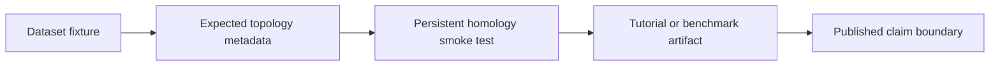

# Benchmark Datasets

The toolkit ships deterministic synthetic fixtures so examples, tests, and
benchmark smoke reports use the same topology contracts.

## Public API

```python
import topoml

names = topoml.list_benchmark_datasets()
circle = topoml.make_noisy_circle(n_samples=64, noise=0.0, random_state=7)
two = topoml.load_benchmark_dataset("two_circles", n_samples=32)
bridge = topoml.make_cluster_bridge()
```

Each call returns `BenchmarkDataset`:

| Field | Meaning |
| --- | --- |
| `name` | Stable fixture name |
| `points` | NumPy point cloud |
| `labels` | Labels for ML smoke tests or visualization |
| `expected_betti` | Topology contract such as `beta1 = 1` |
| `metadata` | Generation settings and fixture notes |

## Fixtures

| Fixture | Purpose | expected_betti |
| --- | --- | --- |
| `make_noisy_circle` | One loop for H1 tutorials and PH regressions | `{"beta0": 1, "beta1": 1}` |
| `make_two_circles` | Two components and two loops for clustering and Mapper demos | `{"components": 2, "loops": 2}` |
| `make_cluster_bridge` | Three-point H0 merge fixture used by the E2E claim gate | `{"beta0@0.1": 3, "beta0@0.3": 2, "beta0@6": 1}` |



## Claim Boundary

These are synthetic benchmark fixtures. They prove that examples and tests share
known topology contracts. They do not replace real domain datasets, leaderboard
benchmarks, or task-specific validation.
