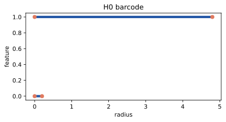
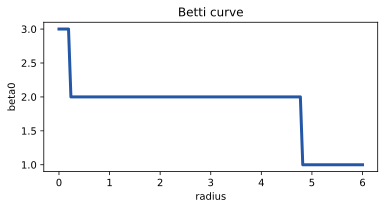

# Persistent Homology

Persistent homology answers one practical question:

> Which holes, clusters, and voids survive as we change the distance scale?

## Vietoris-Rips Complex

Given a point cloud \(X = \{x_1, \ldots, x_n\}\) and radius \(\epsilon\), the
Vietoris-Rips complex is:

\[
VR_\epsilon(X) = \{\sigma \subseteq X : \max_{u,v \in \sigma} d(u,v) \le \epsilon\}
\]

Plain meaning:

- if two points are within \(\epsilon\), add an edge;
- if three points are pairwise within \(\epsilon\), add a triangle;
- if four points are pairwise within \(\epsilon\), add a tetrahedron.

## Barcode

For homology dimension \(k\), the barcode is:

\[
B_k = \{(b_i, d_i)\}_{i=1}^{m}
\]

Each pair means one feature is born at radius \(b_i\) and dies at radius \(d_i\).
Its lifetime is:

\[
p_i = d_i - b_i
\]

Long bars matter more because they survive more scales.

## Betti Curve

The Betti number at radius \(\epsilon\) counts live bars:

\[
\beta_k(\epsilon) = |\{i : b_i \le \epsilon < d_i\}|
\]

For ML, this becomes a curve feature. It says how many connected components,
loops, or voids exist at each scale.

## Failure Modes

Topology is useful when it captures structure beyond norm, density, or recency.
Reject a topology feature if:

- random same-budget features perform the same;
- locality-only features perform the same;
- schedule construction costs more than it saves;
- results only work on one synthetic seed.

