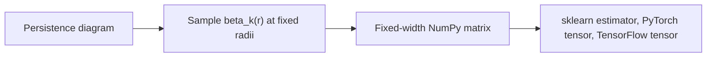

# Persistent Homology Feature Vectors

ML models need fixed-width vectors. Barcodes have variable length. This page
shows the bridge.

## Total Persistence

For barcode lifetimes \(p_i = d_i - b_i\), total persistence of order \(q\) is:

\[
TP_q = \sum_i p_i^q
\]

Use \(q=1\) for total lifetime and \(q=2\) to emphasize long-lived features.

## Persistence Entropy

Normalize lifetimes:

\[
\hat p_i = \frac{p_i}{\sum_j p_j}
\]

Then:

\[
H = -\sum_i \hat p_i \log(\hat p_i)
\]

Low entropy means one or two dominant topological structures. High entropy
means many similar structures.

## Betti Curve Samples

Pick radii \(r_1, \ldots, r_N\). Use:

\[
f = [\beta_0(r_1), \ldots, \beta_0(r_N), \beta_1(r_1), \ldots, \beta_1(r_N)]
\]

This is simple, interpretable, and graphable.

The active Python API exposes this through `PHFeaturizer` for point clouds and
`BettiCurve` for existing diagrams:

```python
features = topoml.PHFeaturizer(max_dim=1, radii=[0.0, 0.25, 0.5, 1.0]).fit_transform(clouds)
curve = topoml.BettiCurve(radii=[0.0, 0.25, 0.5, 1.0]).fit_transform(diagrams)
```



## Chebyshev Radii

Uniform samples waste points near flat regions. Chebyshev nodes concentrate near
the ends:

\[
t_j = \frac{1}{2}\left(1 - \cos\frac{(2j - 1)\pi}{2N}\right)
\]

Map \(t_j\) into your radius range and sample the Betti curve there.

## Persistence Landscape

A persistence pair \((b_i,d_i)\) can be converted into a tent function:

\[
\lambda_i(t) = \max(0, \min(t-b_i, d_i-t))
\]

The \(k\)-th persistence landscape value \(\lambda_k(t)\) is the \(k\)-th
largest tent value at \(t\). Landscapes convert variable-size diagrams into
functions that can be sampled, averaged, and compared.

Status: Formula documented. Direct landscape encoding is not implemented yet.

## Persistence Image

A persistence image maps each point \((b_i,d_i)\) to birth-persistence
coordinates \((b_i, p_i)\), weights it, places a smooth kernel, and samples the
result on a grid:

\[
I(x,y) = \sum_i w(b_i,p_i)\exp\left(-\frac{(x-b_i)^2+(y-p_i)^2}{2\sigma^2}\right)
\]

This produces an image-like tensor for CNNs or tabular models.

Status: Active fixed-grid encoder through `PersistenceImage`. Infinite bars are
excluded because they do not have finite persistence.

```python
image = topoml.PersistenceImage(width=16, height=16, sigma=0.1).fit_transform(diagrams)
```

## Topology Signatures

The active signature helpers expose compact summaries for common ML objects:

```python
point_sig = topoml.point_cloud_signature(points, radii=[0.0, 0.5], max_dim=1)
graph_sig = topoml.graph_signature(adjacency)
activation_sig = topoml.activation_signature(activations, radii=[0.0, 1.0], max_dim=0)
```

For graphs, the first implemented invariant is the cycle rank:

\[
\beta_1(G) = |E| - |V| + c
\]

where \(c\) is the number of connected components.

## Feature Contract

A topological feature encoder should declare:

- input type: point cloud, time series, graph, embedding, or activation tensor;
- homology dimensions used;
- radius grid or image grid;
- handling of infinite bars;
- output shape;
- backend used;
- benchmark artifact proving active claims.
