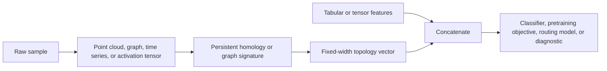

# Topological Training

Topological training means using shape as part of the learning signal. The goal
is not to replace normal ML features. The goal is to add stable structure that
survives coordinate noise, embedding changes, and sampling variation.

## Data Flow



## Topology-Augmented Features

`TopologyAugmenter` appends Betti-curve features to ordinary features:

```python
features = topoml.TopologyAugmenter(
    radii=[0.0, 0.25, 0.5, 1.0],
    max_dim=1,
).fit_transform(point_clouds, base_features=tabular_features)
```

This makes topology usable by mainstream estimators:

- sklearn models can consume the NumPy matrix directly;
- PyTorch and TensorFlow users can convert the matrix to tensors;
- Rust and native backends can target the same feature contract.

## Pretraining Weights

Topology can guide curriculum or pretraining by increasing the weight of samples
whose shape changes across the filtration. The active implementation uses:

\[
w_i = 1 + \|f_i\|_1 + \sum_j |f_{i,j+1} - f_{i,j}|
\]

and normalizes weights to mean one. This is deliberately transparent: it is a
baseline prior, not a magic optimizer.

```python
weights = topoml.topological_sample_weights(
    point_clouds,
    radii=[0.0, 0.25, 0.5, 1.0],
    max_dim=1,
)
```

## Random-Forest Baseline

`TopologyRandomForestClassifier` is a dependency-light executable baseline. It
trains weighted random decision stumps on topology-augmented features. That gives
benchmark suites a serious tabular baseline before comparing to neural models.

```python
model = topoml.TopologyRandomForestClassifier(
    n_estimators=25,
    radii=[0.0, 0.25, 0.5, 1.0],
    max_dim=1,
    random_state=7,
)
model.fit(point_clouds, labels, base_features=tabular_features)
score = model.score(point_clouds, labels, base_features=tabular_features)
```

## TensorBundle Inspiration

ML systems often mix spaces: activations, gradients, token embeddings, graph node
features, and tangent features. `TensorBundleSpec` makes each space explicit:

\[
V = (B, g, \mu, \nu)
\]

where \(B\) is the basis, \(g\) is the metric signature, \(\mu\) is tangent
order, and \(\nu\) is tangent-variable count.

Mixed-space operations use an interoperability morphism:

\[
\mathrm{op}(a \in V, b \in W)
\mapsto
\mathrm{op}(a' \in V \cup W, b' \in V \cup W)
\]

In Python this is a runtime descriptor. The active C++, ASM, CUDA, and Triton
surfaces already expose scoped native or schedule-construction hooks; deeper
compile-time tensor-bundle lowering and kernel-layout rules remain future work.

## Claim Gate

A topological training claim should report:

- raw features used;
- topological features used;
- whether topology sample weights were enabled;
- estimator and random seed;
- baseline without topology;
- benchmark artifact and data shape;
- whether CUDA/Triton/native kernels were used or only CPU reference code.
