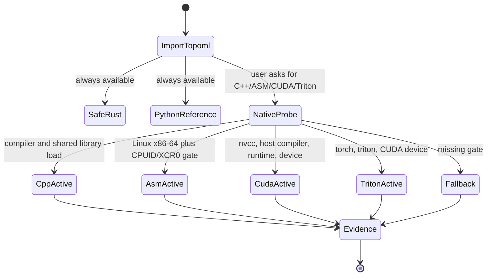
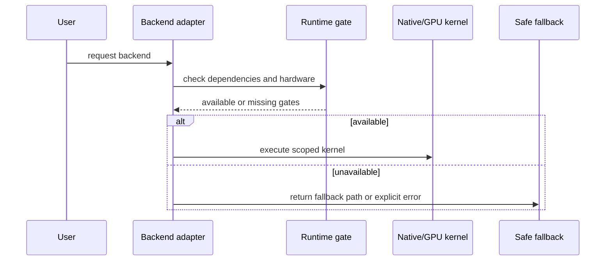

# Backend Runtime Gates

Accelerated topology must be honest about what ran. The toolkit separates active
source code, optional runtime gate availability, and benchmark claims.

## Active APIs

- `topoml.backend_adapters()`
- `topoml.select_backend_adapter(name, raise_unavailable=False)`
- `topoml.build_cpp_native_backend(path)`
- `topoml.build_asm_native_backend(path)`
- `topoml.build_cuda_native_backend(path)`
- `topoml.triton_runtime_status()`

## Claim Boundary

The active accelerated implementations are scoped: C++ preprocessing/H0, ASM
distance dispatch, CUDA pairwise L2 and threshold edges, Triton pairwise L2, and
framework tensor adapters. Broad GPU persistent homology, sparse attention
speedups, and training-quality improvements remain gated by future benchmarks.
