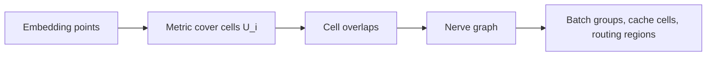
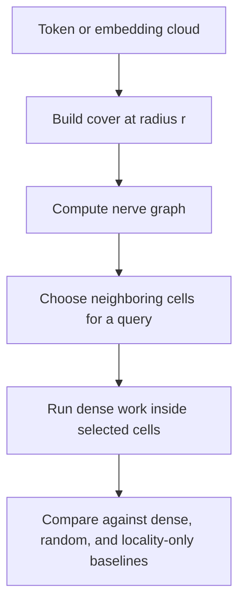

# Covers, Nerves, And Routing

Covers and nerves are the practical bridge between topology and ML systems. They
turn neighborhoods into graph objects that can drive batching, cache regions,
privacy summaries, and routing cells.

## Object

A cover is a family of regions whose union contains the data:

\[
X \subseteq \bigcup_i U_i
\]

The nerve records which cover cells overlap. For two cells:

\[
(i,j) \in E \quad \text{when} \quad U_i \cap U_j \neq \emptyset
\]



## Active API

```python
import numpy as np
import topoml

points = np.array([[0.0, 0.0], [0.2, 0.0], [2.0, 0.0]], dtype=float)

cover = topoml.metric_cover(points, radius=0.25)
nerve = topoml.nerve_graph(cover)

print([cell.members for cell in cover.cells])
print(nerve.edges)
```

## Cech vs Vietoris-Rips

| Construction | Rule | Engineering tradeoff |
| --- | --- | --- |
| Cech / nerve | Cells overlap geometrically | Faithful to covers, useful for routing regions |
| Vietoris-Rips | Pairwise distances are below a threshold | Easier to compute, can overfill higher-dimensional simplices |

The toolkit currently exposes metric covers and nerve graphs as prototype
systems objects. Vietoris-Rips persistent homology is the active PH core.

## Routing Use Case



The key engineering question is not whether a cover looks elegant. The question
is whether it reduces work without hiding important local evidence.

## Benchmark Gate

A cover-routing claim should report:

- radius, metric, and cover construction time;
- selected cells or selected tokens;
- dense baseline;
- same-budget random baseline;
- same-budget locality baseline;
- memory movement or estimated FLOPs;
- task metric or attention-error metric;
- end-to-end time, not only schedule-build time.
