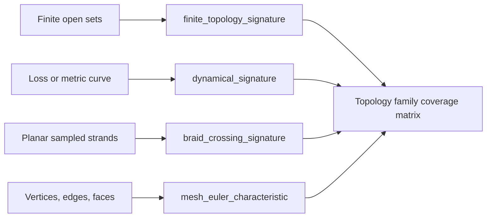
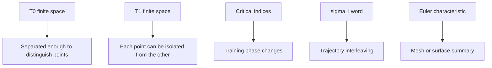

# Finite Topology, Dynamics, Braids, And Meshes

This page shows the finite diagnostics that move several topology families from
docs-only language into executable API checks.



## Active API

```python
finite = topoml.finite_topology_signature({"a", "b"}, [set(), {"a"}, {"a", "b"}])
dynamics = topoml.dynamical_signature([3.0, 2.0, 1.2, 1.6, 1.1])
braid = topoml.braid_crossing_signature(strands)
mesh = topoml.mesh_euler_characteristic(vertices, edges, faces)
```

## How To Read It



## Claim Boundary

These APIs are finite sampled diagnostics. They do not prove arbitrary
topological theorems, compute knot polynomials, solve full Conley index
decompositions, or classify manifolds. They give data scientists and systems
engineers inspectable invariants that can be put into tests and benchmark
artifacts.
