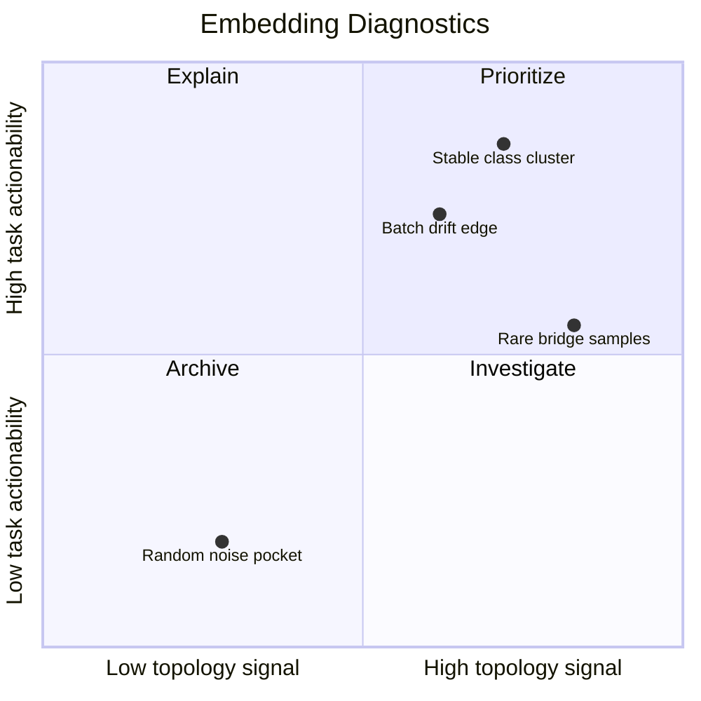
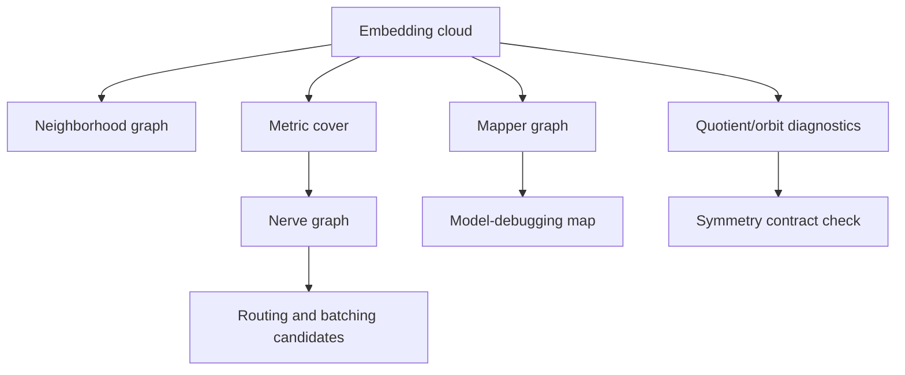

# Manifold Embedding Neighborhood Graph

Embeddings are not only coordinates. They imply neighborhoods, cover cells,
quotient regions, drift pockets, and graph summaries that can be tested.



## Active APIs

Use `metric_cover`, `nerve_graph`, `mapper_graph`, `finite_orbit_signature`, and
`equivariance_residual` to turn embeddings into graph-ready diagnostics.

```python
cover = topoml.metric_cover(embedding, radius=0.5)
nerve = topoml.nerve_graph(cover)
mapper = topoml.mapper_graph(embedding, filter_values=loss, intervals=8, overlap=0.25)
```



## Claim Boundary

The library gives executable graph diagnostics for embeddings. It does not claim
that every embedding is a manifold, that every graph is faithful, or that a
topology graph is better than UMAP, nearest-neighbor graphs, or label-based
inspection without benchmark evidence.
