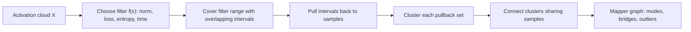
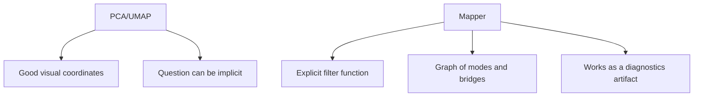

# Mapper And Reeb Activation Maps

Mapper turns an embedding or activation cloud into a graph that a data scientist
can inspect. The graph is not a projection. It is a cover-and-cluster summary of
how the data changes under a scalar filter.

## Object

Let \(X\) be an activation cloud and let:

\[
f : X \to \mathbb{R}
\]

be a filter such as layer norm, loss, entropy, time, confidence, or the first
principal component. Mapper covers the range of \(f\), pulls each interval back
to the data, clusters inside each pullback, and connects clusters that share
samples.



## Active API

```python
import numpy as np
import topoml

points = np.array([[0.0], [0.4], [0.8]], dtype=float)
filters = np.array([0.0, 0.4, 0.8], dtype=float)

graph = topoml.mapper_graph(
    points,
    filters,
    intervals=2,
    overlap=0.75,
    cluster_radius=1.0,
)

print(graph.edges)  # ((0, 1),)
```

## How To Read The Graph

| Pattern | Meaning | ML action |
| --- | --- | --- |
| Dense node | Many samples share a filter range and local geometry | Inspect representative samples or activation centroid |
| Bridge edge | Two regions overlap through shared samples | Check transition regime, boundary cases, or routing handoff |
| Leaf node | Region has one narrow path into the rest of the data | Inspect outliers, rare classes, drift pockets |
| Disconnected component | Filter/geometry splits the data | Compare labels, batches, shards, or model versions |

## Why Not Just PCA Or UMAP?

PCA and UMAP create coordinates. Mapper creates a graph from a chosen question.
If the question is "where does loss jump?" use loss as \(f\). If the question is
"which activations are high entropy?" use entropy as \(f\). The graph keeps that
question visible.



## Claim Boundary

The current implementation is a prototype diagnostics API. It does not claim to
beat UMAP, accelerate training, or improve model quality by itself. A production
claim needs:

- a declared filter and cluster radius;
- a baseline visualization or diagnostic;
- an interpretability or detection task;
- same-data comparison against PCA/UMAP-only inspection;
- a benchmark artifact with construction time and graph size.
