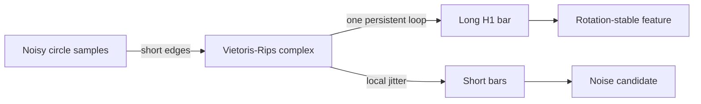

# Noisy Circles

A circle has one main loop. Persistent homology should see one long H1 bar.

Use this example to explain:

- why short bars are often noise;
- why one long H1 bar is a useful feature;
- why a classifier can use topology when coordinates rotate or warp.

## Claim Boundary

This page demonstrates the interpretation of a loop feature. It does not claim
classification improvement unless a benchmark compares topology features against
coordinate, PCA, random, and task-specific baselines on the same split.
