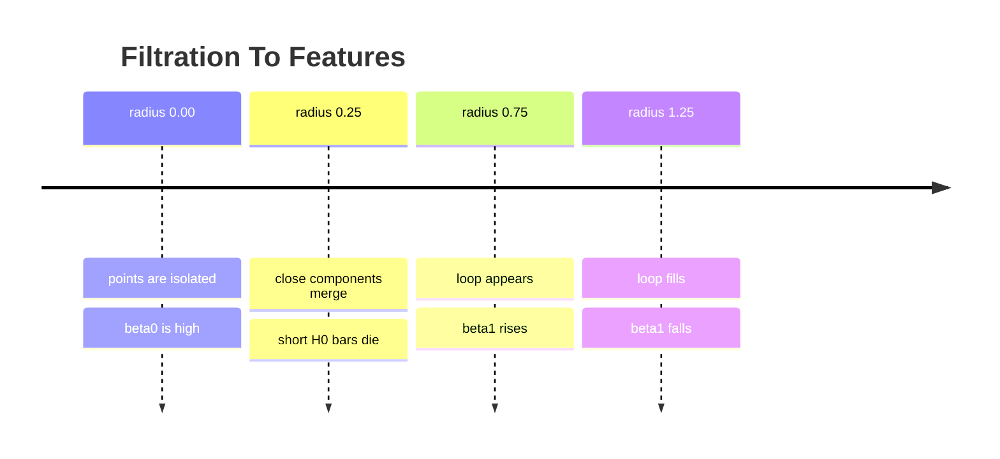
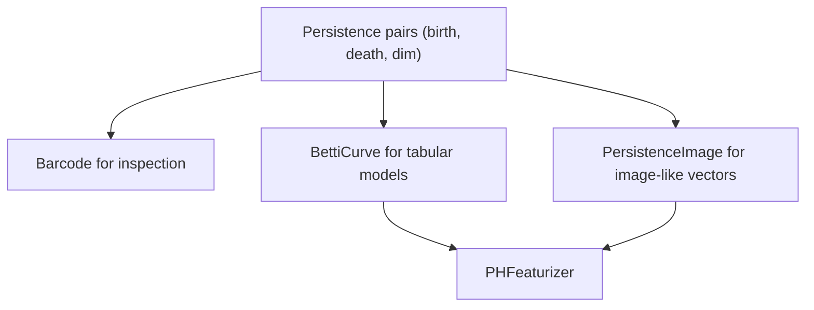

# Persistence Barcode And Betti Curves

Persistent homology produces intervals. ML models usually need fixed-width
vectors. This page shows the bridge: barcode intervals become Betti curves,
persistence images, or small signature dictionaries.



## Active API

```python
import topoml

diagram = topoml.persistent_homology(points, max_dim=1, max_radius=2.0)
curve = topoml.BettiCurve(radii=[0.0, 0.25, 0.75, 1.25]).fit_transform([diagram])
image = topoml.PersistenceImage(width=16, height=16).fit_transform([diagram])
```

## Reading The Graph

The barcode answers "how long did a feature live?" The Betti curve answers "how
many features are alive at this radius?" The persistence image answers "where
are stable features concentrated in birth-persistence space?"



## Claim Boundary

These are active feature encoders. They are not universal best encodings. A
training claim must state the radii, homology dimensions, image resolution,
baseline feature set, split policy, and whether topology improved held-out
metrics.
