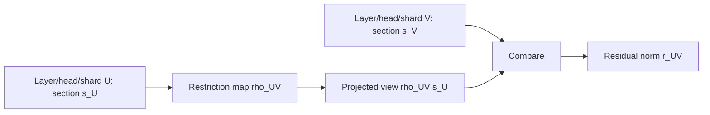
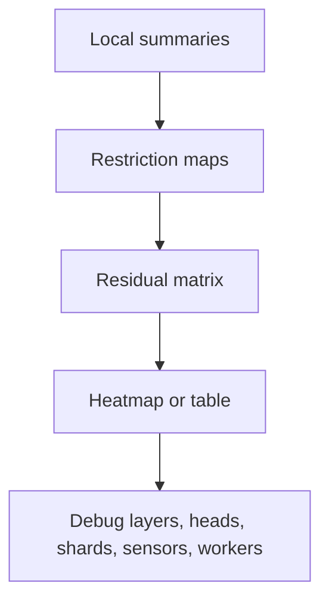

# Sheaf Consistency Residuals

Sheaves are a precise way to ask whether local views agree. In ML systems, those
local views can be layers, attention heads, shards, feature stores, sensors, or
workers.

## Object

A sheaf attaches data to local regions and restriction maps between them. For an
edge \(U \to V\), the restriction map is:

\[
\rho_{U,V}: F(U) \to F(V)
\]

Given sections \(s_U\) and \(s_V\), the residual is:

\[
r_{U,V} = \|\rho_{U,V}s_U - s_V\|
\]

Large residuals mark disagreement between local views.



## Active API

```python
import numpy as np
import topoml

residual = topoml.sheaf_consistency_residual(
    {
        "head0": np.array([1.0, 2.0]),
        "head1": np.array([1.0, 3.0]),
    },
    [("head0", "head1", np.eye(2))],
)

print(residual.edge_residuals)
print(residual.max_residual)
```

## Injected Inconsistency Example

| Edge | Expected relation | Observed residual | Interpretation |
| --- | --- | --- | --- |
| `head0 -> head1` | Identity map | `0.0` | Heads agree under the chosen summary |
| `head0 -> head1` | Identity map | `1.0` | One component changed; inspect the responsible channel |
| `shard0 -> shard1` | Projection map | high residual | Feature-store or data-shard mismatch candidate |

## Why This Matters

Many failures in ML systems are not visible in one scalar metric. A model can
have acceptable accuracy while two heads, shards, or telemetry streams disagree.
Sheaf residuals make local disagreement explicit.



## Claim Boundary

The current API is a diagnostic. It is not a speedup claim. It becomes a systems
claim only when the residual changes a decision, such as keeping a region dense,
rejecting a shard, or routing a worker differently, and that decision beats:

- scalar variance;
- random edge checks;
- locality-only checks;
- the existing production alert or diagnostic baseline.
