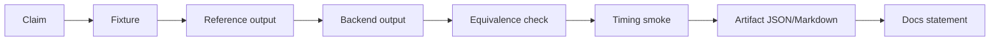
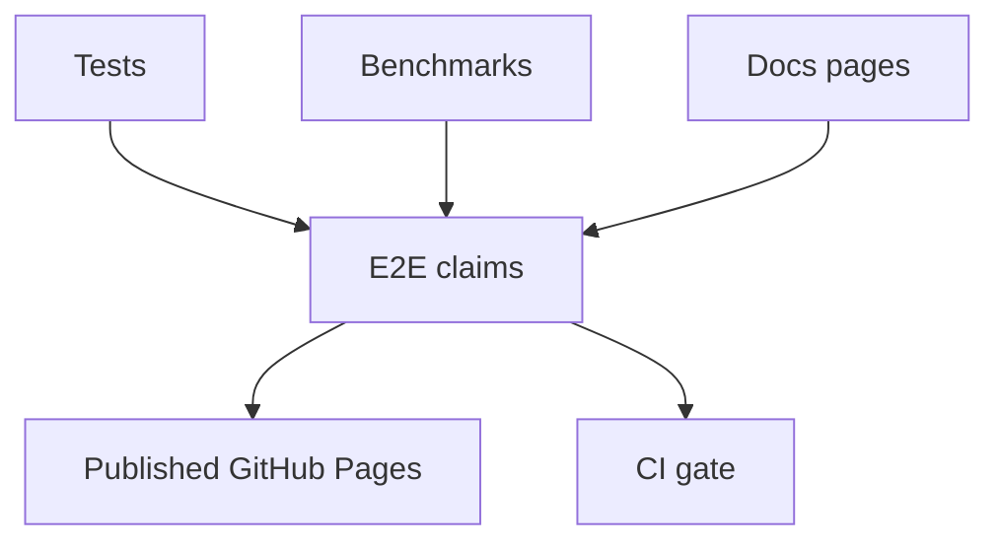

# TDA Benchmark Evidence Map

Every performance or quality claim needs an evidence path. The benchmark suite
records active behavior and keeps future acceleration work from becoming a
README-only promise.

## Current Evidence Paths

| Claim area | Evidence command | Boundary |
| --- | --- | --- |
| Python/Rust PH behavior | `python -m pytest python/tests -q` | Correctness and contracts, not speedup |
| Native C++/ASM/CUDA/Triton source | backend-specific tests | Runtime-gated where tools/hardware are absent |
| E2E public claims | `python benchmarks/e2e_claims.py` | Smoke benchmark and claim registry |
| Docs and gallery | `python -m mkdocs build --strict` | Site builds, diagrams render through Mermaid |

## Claim Boundary

The benchmark map proves that claims have a runnable verification path. It does
not turn smoke timings into leaderboard results. Any speed claim must include a
named baseline, hardware, data size, variance policy, and failure conditions.
