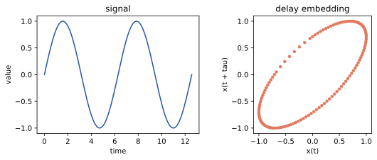
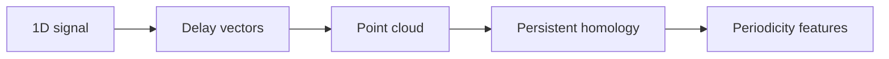

# Time Delay

Periodic signals become loops after time-delay embedding.

Pipeline:

```mermaid
flowchart LR
  A["1D signal"] --> B["Delay vectors"]
  B --> C["Point cloud"]
  C --> D["Persistent homology"]
  D --> E["Periodicity features"]
```

