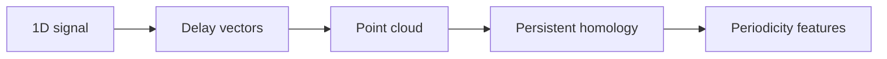
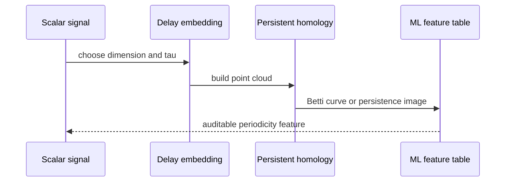

# Time Delay

Periodic signals become loops after time-delay embedding.

Pipeline:

## Claim Boundary

The active API builds delay vectors and topology features. It does not estimate
the best lag automatically, prove periodicity for arbitrary signals, or beat a
spectral baseline without a task benchmark.
