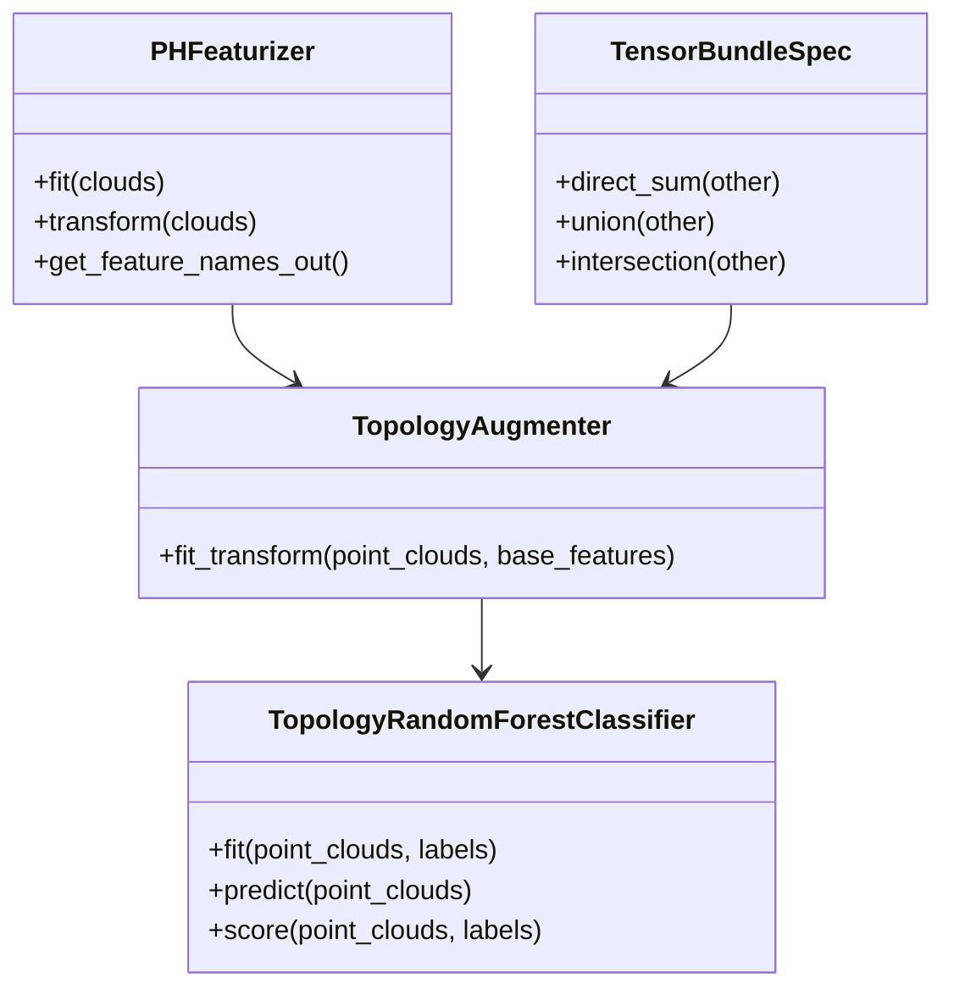
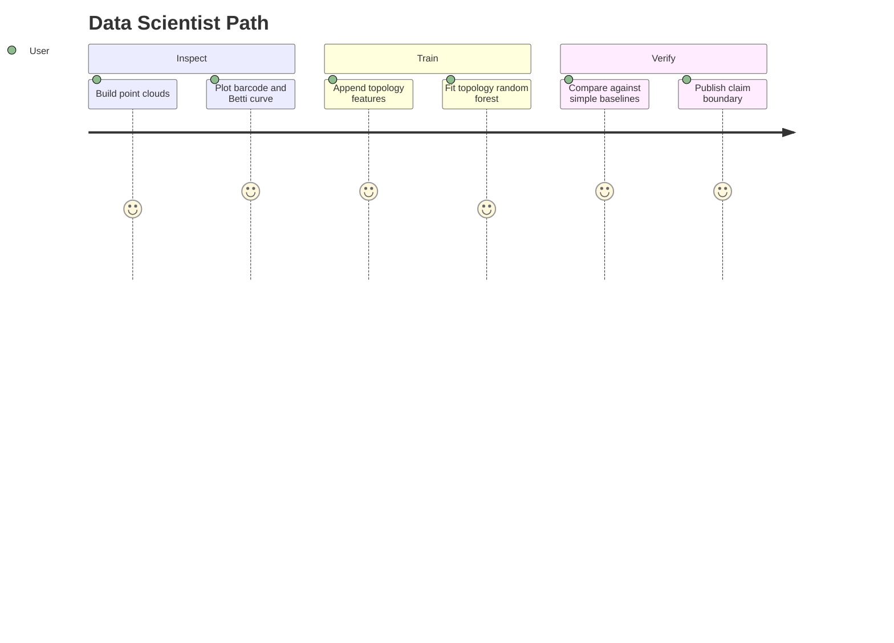

# Topology Training Pipeline

Topological ML becomes useful when topology enters a normal training workflow
without forcing the whole project to become a topology project.



## Active API

```python
augmenter = topoml.TopologyAugmenter(radii=[0.0, 0.25, 0.5], max_dim=1)
features = augmenter.fit_transform(point_clouds, base_features=tabular_features)
weights = topoml.topological_sample_weights(point_clouds, radii=[0.0, 0.25, 0.5])
model = topoml.TopologyRandomForestClassifier(radii=[0.0, 0.25, 0.5])
model.fit(point_clouds, labels, base_features=tabular_features, sample_weight=weights)
```



## Claim Boundary

The current training surface is an executable baseline for tabular experiments.
It is not a replacement for scikit-learn, PyTorch, TensorFlow, or XGBoost. Use it
to prove that topology features add signal before moving the same ideas into
larger training stacks.
