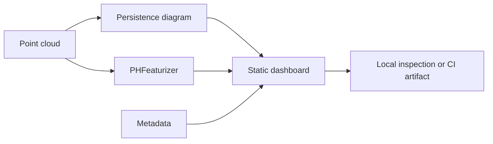

# GUI Dashboard Export

Topological ML Toolkit includes a lightweight dashboard exporter for inspection,
CI artifacts, and demos.

Status: Active prototype. It writes a static, self-contained HTML file. It is
not a hosted application server and does not require Plotly, React, PyTorch,
TensorFlow, or Triton.

## Why A Static Dashboard

Topology is easier to understand when the diagram, feature matrix, and metadata
are visible together. A static export is useful because it can be:

- opened locally from disk;
- uploaded as a CI artifact;
- attached to benchmark output;
- linked from project documentation;
- reviewed without installing a frontend stack.

## Example

```python
import numpy as np
import topoml

points = np.array([[0.0, 0.0], [0.2, 0.0], [1.0, 0.0]])
diagram = topoml.persistent_homology(points, max_dim=0, max_radius=2.0)
features = topoml.PHFeaturizer(max_dim=0, radii=[0.0, 0.5]).fit_transform([points])

topoml.write_dashboard(
    "artifacts/dashboard.html",
    title="Topology inspection",
    diagram=diagram,
    feature_matrix=features,
    metadata={"dataset": "example"},
)
```

## Dashboard Contents

The generated page contains:

- summary metrics;
- persistence diagram rows;
- feature matrix rows;
- metadata as formatted JSON.



## Claim Boundary

The dashboard exporter is a GUI support layer. It does not claim interactive
notebook widgets, cloud hosting, WebGL rendering, or framework integration. Those
can be added later behind tests and examples.
