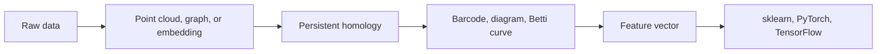

# Topological ML Toolkit

Topology should not feel like a locked math cave. This toolkit shows the shape
of data, turns that shape into ML features, and keeps the performance story
honest.

## Data Scientist Path

## What You Get

- Persistent homology for point clouds.
- Time-delay embeddings for time series.
- Graph-ready diagrams, barcodes, and Betti curves.
- Benchmark rules that compare against real baselines.
- Backend plan from safe Rust to C++, ASM, Triton, PyTorch, and TensorFlow.

## What This Project Refuses

- No mystery speedup claims.
- No theorem names without derivations.
- No GPU kernel claim without dense and same-budget baselines.
- No documentation that assumes the reader already knows algebraic topology.

