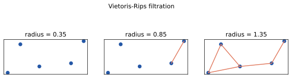
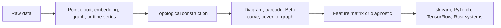

# Topological ML Toolkit

Topological ML Toolkit teaches and implements topology as an engineering tool
for machine learning pipelines.

Topology studies structure that survives continuous deformation. For ML, that
means measuring shape instead of only coordinates: connected components, loops,
voids, covers, neighborhoods, trajectories, and consistency constraints. Those
measurements can become features, diagnostics, or routing rules.

## Pipeline View

## What Is Active Today

- Point-cloud persistent homology for dimensions 0 through 2.
- Time-delay embeddings for scalar time series.
- Betti-number queries at chosen radii.
- Plotly-shaped persistence diagram traces.
- `PHFeaturizer`, a sklearn-style transformer that emits fixed-width Betti
  curves.
- TensorBundle-style interoperability descriptors for explicit metric spaces.
- Topology-augmented training helpers, sample weights, and a dependency-light
  random-forest baseline.
- Generated diagrams for docs and tutorials.
- E2E claim benchmarks that verify active behavior.

## What Is API-Level Roadmap

The repository exposes an active C++ H0 native path, active hardware-gated ASM
L2-squared dispatch, active optional CUDA and Triton pairwise-L2 runtime
wrappers, and active optional PyTorch and TensorFlow tensor adapters. The docs
do not claim acceleration until equivalence tests and benchmark baselines pass.

## Learning Path

1. Start with persistent homology to understand connected components, loops, and
   lifetimes.
2. Convert diagrams into Betti curves and fixed-width feature vectors.
3. Use manifold and embedding docs to connect topology to model activations.
4. Use topological training to append shape features to tabular, tensor, or
   embedding pipelines.
5. Read the topology landscape for broader families such as covers, Mapper,
   sheaves, homotopy, dynamical topology, stratified spaces, and quotient
   spaces.
6. Check the benchmark pages before trusting any speed or backend claim.

## Evidence Policy

Every active repository claim should have one of three forms:

- a unit test;
- an E2E claim benchmark artifact;
- a docs-only statement clearly labeled as theory or roadmap.

That standard keeps the project marketable without turning planned systems into
unverified claims.
