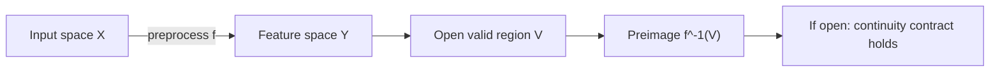
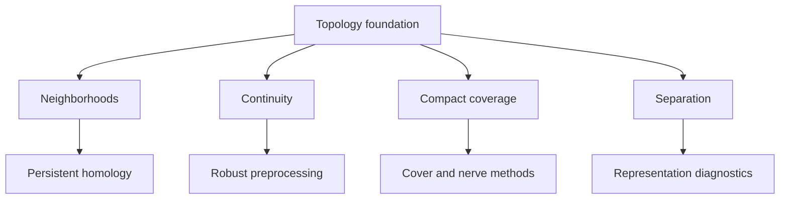

# Topology Foundations For ML Engineers

Topology is the study of structure that survives continuous deformation. For ML
engineers, it is a language for stability: which clusters, neighborhoods,
boundaries, and relationships remain meaningful when coordinates, sampling, or
noise change.

Status: Docs-only, with active links to persistent homology and feature
extraction where the current library has executable support.

## Topological Space

A topological space is a set \(X\) plus a collection of open sets \(\tau\). The
collection \(\tau\) must satisfy:

- \(\emptyset \in \tau\) and \(X \in \tau\);
- any union of open sets is open;
- any finite intersection of open sets is open.

This gives a general definition of neighborhood and continuity without assuming
Euclidean coordinates.

ML translation: a topology tells the pipeline what counts as local information,
what counts as a stable neighborhood, and what transformations preserve valid
structure.

## Continuity

A function \(f : X \to Y\) is continuous when every open set in the output pulls
back to an open set in the input:

\[
V \subseteq Y \text{ open} \Rightarrow f^{-1}(V) \subseteq X \text{ open}
\]

ML translation: small or locally valid changes before preprocessing should not
create uncontrolled jumps after preprocessing.

Status: Docs-only foundation. Concrete continuity tests become prototype APIs
only when they target a specific data transform.

## Neighborhoods

A neighborhood of \(x\) is a set containing an open set around \(x\). In metric
spaces this often looks like a ball:

\[
B_\epsilon(x) = \{y : d(x,y) < \epsilon\}
\]

ML translation: nearest neighbors, embedding neighborhoods, local explanations,
and local robustness tests all depend on a neighborhood contract.

## Compactness

A space is compact if every open cover has a finite subcover:

\[
X \subseteq \bigcup_{\alpha \in A} U_\alpha
\Rightarrow
X \subseteq U_{\alpha_1} \cup \cdots \cup U_{\alpha_n}
\]

ML translation: compactness is the mathematical version of finite coverage. It
supports statements such as "this validation grid covers the operating region"
or "these representative cells cover the embedding space."

Status: Docs-only foundation. Cover-based routing is a prototype target.

## Connectedness

A space is connected if it cannot be split into two nonempty disjoint open sets.
Persistent homology turns this into an executable signal through \(H_0\), where
\(\beta_0\) counts connected components at a chosen radius.

Status: Active benchmarked for small bounded Vietoris-Rips examples.

## Separation

Separation axioms define how well a topology can distinguish points. A common
condition is Hausdorff separation: for any two distinct points \(x \ne y\), there
exist disjoint neighborhoods \(U\) and \(V\):

\[
x \in U,\quad y \in V,\quad U \cap V = \emptyset
\]

ML translation: if two states cannot be separated by the representation, a model
or monitoring system may be unable to distinguish them reliably.

## Why This Matters Before Homology

Persistent homology is one tool. The broader topology foundation matters because
ML systems also need:

- valid neighborhoods for approximate search;
- continuity contracts for preprocessing;
- finite covers for batching and routing;
- connectedness checks for cluster structure;
- separation checks for representation quality;
- compactness assumptions for validation coverage.

