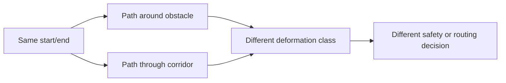
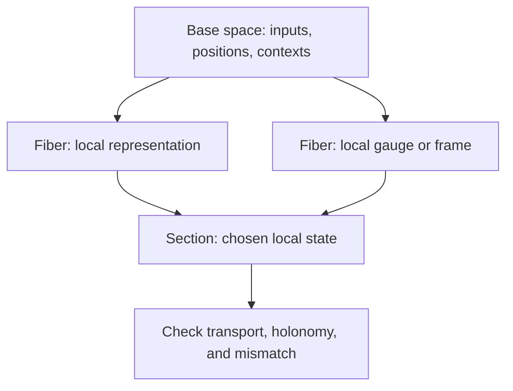

# Geometry, Symmetry, And Trajectories

This page covers topology families that often show up in modern ML systems but
are not the same as persistent homology.

Status: mixed. Homotopy, stratified spaces, and finite group actions now have
small prototype diagnostics. Knot/link, low-dimensional, and categorical
topology remain docs-only until they have datasets and baselines that make the
signal actionable.

## Stratified And Singular Spaces

Real ML data is often not a smooth manifold. ReLU networks create regions,
decision boundaries have corners, embeddings contain seams, and failure surfaces
can be lower-dimensional.

A stratified space decomposes a space into pieces:

\[
X = \bigcup_i S_i
\]

Each stratum \(S_i\) is easier to model than the whole space. The frontier
condition says if one stratum touches the closure of another, their dimensions
must fit a controlled hierarchy.

ML use cases:

- inspect ReLU regions;
- describe decision-boundary strata;
- detect non-manifold embedding artifacts;
- separate boundary failures from bulk failures.

Prototype: `topoml.activation_strata` records activation sign-pattern strata
and boundary fractions. It is a ReLU-region diagnostic, not a complete
stratified-space implementation.

## Homotopy

Homotopy studies when one path, map, or shape can be continuously deformed into
another.

Two paths \(\gamma_0,\gamma_1 : [0,1] \to X\) are path-homotopic when there is a
continuous map:

\[
H : [0,1] \times [0,1] \to X
\]

with \(H(s,0)=\gamma_0(s)\), \(H(s,1)=\gamma_1(s)\), and endpoints fixed.

For ML, homotopy can distinguish optimization paths or planning trajectories
that homology may compress into the same count.

Prototype: `topoml.path_homotopy_signature` computes the winding number of a
finite 2D loop around a basepoint:

\[
w = \mathrm{round}\left(\Delta \theta / 2\pi\right)
\]

This catches simple loop classes around an obstacle. It does not compute a full
fundamental group.

## Cohomology Beyond Betti Counts

Betti numbers count how many independent features exist. Cohomology can encode
interactions, consistency constraints, and obstructions.

A cochain complex has maps:

\[
C^0 \xrightarrow{d} C^1 \xrightarrow{d} C^2
\]

with:

\[
d \circ d = 0
\]

A cocycle satisfies \(d\alpha = 0\). A nontrivial cohomology class can indicate
global structure that local patches cannot remove.

ML use cases:

- feature interaction diagnostics;
- distributed consistency checks;
- circular coordinates;
- obstruction-style tests for incompatible local explanations.

## Groups, Quotients, And Equivariance

A group action describes a symmetry:

\[
G \times X \to X
\]

The orbit of a point is:

\[
Gx = \{g \cdot x : g \in G\}
\]

The quotient \(X/G\) identifies points that differ only by the group action.
For ML, this is the language behind rotation invariance, permutation
equivariance, gauge-equivariant models, and symmetry-aware tests.

Prototype APIs:

- `topoml.finite_orbit_signature` summarizes a finite sampled orbit, stabilizer
  count, and quotient representative.
- `topoml.equivariance_residual` tests finite sampled invariance or equivariance
  residuals across model outputs.

These APIs test sampled actions only. They do not prove a model is equivariant
for a continuous group.

## Bundles And Sections

A fiber bundle has a projection:

\[
\pi : E \to B
\]

The base \(B\) represents positions or contexts. The fiber over \(b\) contains
local values above that context:

\[
\pi^{-1}(b)
\]

A section chooses one value from each fiber. In ML language, bundles are useful
for layerwise parameter transport, local coordinate systems, gauge fields,
distributed model alignment, and symmetry defects.

## Knots, Braids, And Links

Knots and braids study embedded curves and crossings. A braid word is built from
generators such as:

\[
\sigma_i
\]

where \(\sigma_i\) swaps neighboring strands with a crossing.

ML and systems use cases are early-stage:

- multi-agent trajectory entanglement;
- robotics path planning;
- thread interleavings;
- attention-head coupling over depth;
- recurrent trajectory crossings in latent space.

Status: Docs-only until there is a dataset, invariant, and baseline that makes
the signal actionable.

## Low-Dimensional And Geometric Topology

For surfaces, the Euler characteristic is:

\[
\chi = V - E + F
\]

For an orientable closed surface of genus \(g\):

\[
\chi = 2 - 2g
\]

This matters for meshes, scenes, robotics maps, simulation surfaces, and any ML
pipeline that predicts geometry. If a model changes genus, breaks orientability,
or creates invalid handles, topology can catch it.

Status: Docs-only first. A prototype should start with mesh diagnostics and
compare against ordinary geometry-only validation.

## Categorical And Pointless Topology

Pointless topology describes spaces through open sets instead of points. A
locale or frame treats opens as the primary object, with operations similar to
intersection and union.

For distributed systems and observability, this is useful because a system may
know regions, constraints, logs, or covers without knowing exact points.

Status: Docs-only. This is foundation material for future sheaf and observability
APIs, not an active implementation claim.
