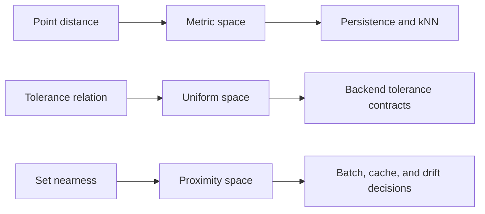
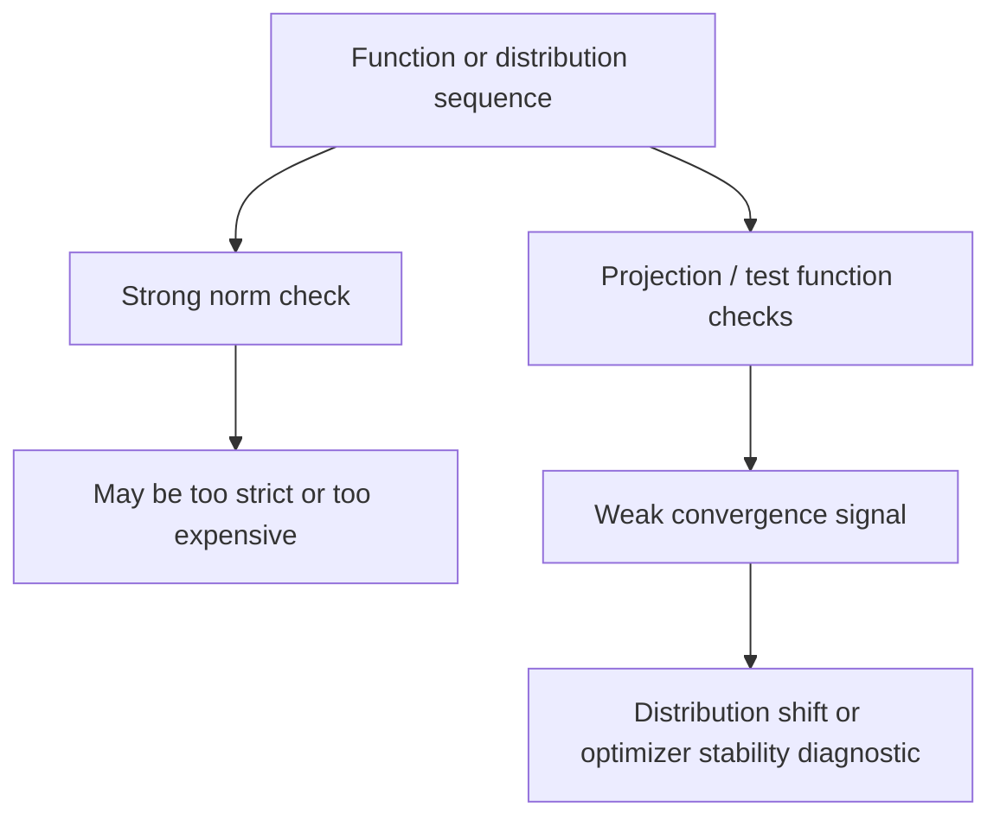

# Metric, Proximity, And Function Spaces

Many ML systems start with vectors, distances, and functions. Topology provides
the rules for when those distances and functions behave consistently.

Status: Docs-only plus Prototype API targets. Active code currently uses
Euclidean point clouds and time-delay embeddings.

## Metric Spaces

A metric \(d : X \times X \to \mathbb{R}_{\ge 0}\) must satisfy:

\[
d(x,y) = 0 \Leftrightarrow x = y
\]

\[
d(x,y) = d(y,x)
\]

\[
d(x,z) \le d(x,y) + d(y,z)
\]

ML translation: distance is not just an implementation detail. It determines
nearest neighbors, persistence radii, clustering behavior, approximate search,
and routing cells.

## Cauchy Behavior

A sequence \((x_n)\) is Cauchy when:

\[
\forall \epsilon > 0,\ \exists N,\ \forall m,n \ge N,\ d(x_m,x_n) < \epsilon
\]

ML translation: a training run, streaming embedding, or online summary may look
stable if its later states become mutually close. This is different from being
close to a known target.

## Uniform Spaces

Uniform spaces generalize metric spaces by describing nearness through
entourages rather than one fixed distance function. An entourage is a subset:

\[
U \subseteq X \times X
\]

If \((x,y) \in U\), then \(x\) and \(y\) are considered close under that
tolerance.

ML translation: this is useful when a backend needs tolerance contracts across
mixed precision, approximate kernels, quantized features, or hardware-specific
distance paths.

## Proximity Spaces

Proximity spaces describe when sets are near each other, not only when points are
near each other. Write:

\[
A \ \delta\ B
\]

to mean set \(A\) is near set \(B\).

ML translation: this is a natural language for cluster-level drift, batch
overlap, cache reuse, and feature-store consistency.

## Topological Vector Spaces

A topological vector space is a vector space with a topology where addition and
scalar multiplication are continuous:

\[
(x,y) \mapsto x+y
\]

\[
(\alpha,x) \mapsto \alpha x
\]

ML translation: this is the foundation for talking about convergence of model
parameters, embeddings, kernels, gradients, and distributions beyond finite
Euclidean arrays.

## Seminorm Neighborhoods

A seminorm \(p\) behaves like a norm but may assign zero to nonzero vectors.
Neighborhoods can be described by:

\[
U_{p,\epsilon}(x) = \{y : p(y-x) < \epsilon\}
\]

Multiple seminorms can define different notions of closeness.

ML translation: one model update can be small under a weak diagnostic and large
under another. That matters for monitoring and distribution shift.

## Weak Convergence

A sequence \(x_n\) converges weakly to \(x\) when every continuous linear
functional \(\phi\) sees convergence:

\[
\phi(x_n) \to \phi(x)
\]

ML translation: weak convergence is relevant when models or distributions
converge under tests or projections even if they do not converge strongly in
norm.

## API Direction

Future metric and function-space APIs should expose:

- explicit metric objects;
- tolerance contracts for backend equivalence;
- neighborhood samplers;
- drift diagnostics over sets;
- weak convergence tests over selected probes;
- benchmark artifacts comparing against norm-only drift checks.

No such API should be called active until it has unit tests, E2E examples, and a
failure case where it adds information beyond ordinary Euclidean distance.
