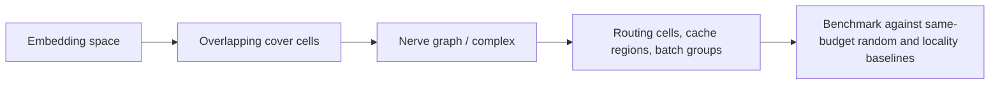
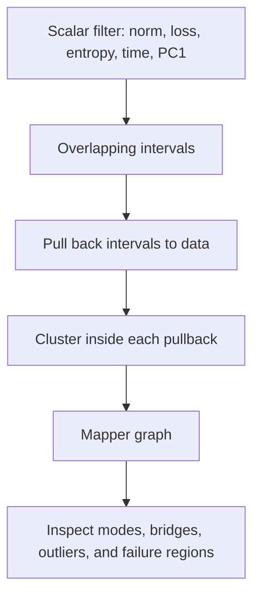

# Systems Topology For ML

Topology becomes useful in ML systems when it changes a decision: which data to
batch, which activations to inspect, which shards disagree, which trajectories
are stable, or which backend is allowed to run.

Status: Docs-only and Prototype API. The current repository documents these
families and exposes backend contracts. It does not claim accelerated systems
behavior yet.

## Covers, Nerves, And Routing

A cover is a set of regions whose union contains the data:

\[
X \subseteq \bigcup_{i \in I} U_i
\]

The nerve of the cover is a simplicial complex. A subset
\(\{i_0, \ldots, i_k\}\) forms a simplex when:

\[
U_{i_0} \cap \cdots \cap U_{i_k} \neq \emptyset
\]

For ML systems, covers are a clean way to talk about batching, cache regions,
approximate nearest-neighbor cells, activation neighborhoods, or sparse routing
blocks.

Promotion gate: a cover-based method must beat a same-budget non-topological
selector on the task metric, and it must report construction overhead.

## Mapper And Reeb Graphs

Mapper turns a dataset into a graph using a filter function
\(f : X \to \mathbb{R}\), a cover of the filter range, and connected components
inside each pullback set.

The Reeb graph identifies points in the same connected component of a level set:

\[
x \sim y \quad \text{if } f(x)=f(y) \text{ and } x,y
\text{ are in the same connected component of } f^{-1}(f(x))
\]

For ML practitioners, the result is an interpretable graph of a dataset,
activation space, loss surface, entropy score, or routing state.

Status: Prototype API target. No active Mapper implementation is claimed yet.

## Sheaves And Cosheaves

A sheaf models local data attached to parts of a space plus restriction maps
that tell local views how to agree. For \(V \subseteq U\), a restriction map is:

\[
\rho_{U,V}: F(U) \to F(V)
\]

A simple consistency residual for two adjacent local views is:

\[
r_{U,V} = \|\rho_{U,V}s_U - s_V\|
\]

In ML systems, stalks can represent layers, heads, shards, feature stores,
sensors, or workers. Residuals can identify where local views disagree.

Status: Docs-only first, then prototype diagnostics. Sheaf residuals should not
be sold as a speedup unless they drive a measured routing or compression rule.

## Domain Theory And Scott Topology

Many systems objects are ordered by information content: partial results,
compiler facts, cache states, abstract interpreter states, or streaming
summaries.

A directed complete partial order supports least fixed points:

\[
\operatorname{fix}(f) = \sup_{n \ge 0} f^n(\bot)
\]

Scott topology gives a mathematical language for monotone computation and
observable convergence. For ML infrastructure, this is relevant to schedulers,
dataflow systems, incremental compilation, and runtime proofs.

Status: Docs-only. This belongs in core only after there is a concrete monotone
API and a testable systems invariant.

## Dynamical Topology

Training is a trajectory through parameter, activation, and metric spaces.
Dynamical topology studies recurrent sets, attractors, repellers, and invariant
regions.

A point \(x\) is critical for a smooth scalar field \(f\) when:

\[
\nabla f(x) = 0
\]

Morse theory studies how topology changes at critical points. Conley-style
methods focus on invariant sets and flow behavior.

Status: Prototype target. A useful first deliverable is a gallery that compares
training trajectories and shows stable versus unstable regimes before final
accuracy diverges.

## Backend Contract Rule

For systems claims, the backend contract must answer:

- What object is computed?
- What optional dependency is required?
- What correctness gate compares against the active reference?
- What baseline falsifies the speed or memory claim?
- What happens when the backend is unavailable?

The current API uses explicit planned backend adapters so an unavailable
accelerator cannot silently execute as a different backend.
