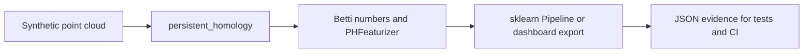
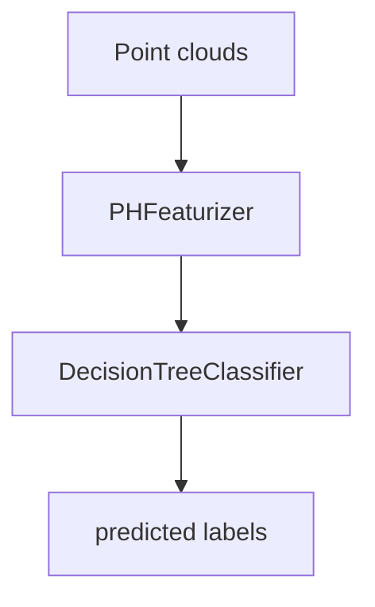
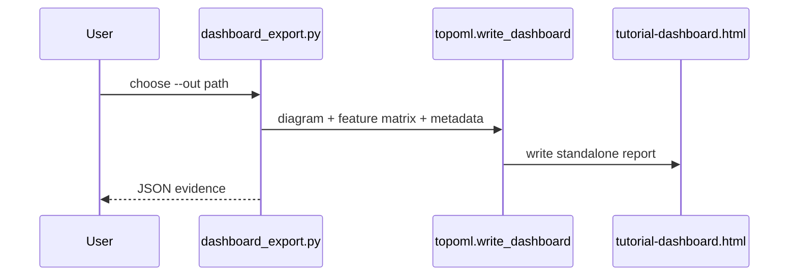

# Runnable Tutorials

These tutorials are executable smoke paths, not screenshots. Each script prints
JSON evidence that is also checked by `python/tests/test_examples.py` and by the
repository E2E claim gate.



## Point Cloud Persistent Homology

Run:

```powershell
python examples/point_cloud_ph.py
```

What it proves:

- loads the deterministic `noisy_circle` benchmark fixture;
- computes `persistent_homology(..., max_dim=1)`;
- checks that the tutorial radius exposes one persistent loop;
- emits `feature_shape` and `feature_names` from `PHFeaturizer`.

Expected JSON fields:

```json
{
  "dataset": "noisy_circle",
  "betti_at_radius": {"beta0": 1, "beta1": 1},
  "feature_shape": [1, 4]
}
```

## sklearn Pipeline

Run:

```powershell
python examples/sklearn_pipeline.py
```

What it proves:

- `import topoml` does not import sklearn;
- when sklearn is installed, `make_sklearn_pipeline` builds a real
  `Pipeline`;
- topological features distinguish a near two-point cloud from a far two-point
  cloud under a tiny decision-tree smoke model.

If sklearn is not installed, the script emits `sklearn_available: false`
instead of pretending the integration ran.



## Dashboard Export

Run:

```powershell
python examples/dashboard_export.py --out artifacts/tutorial-dashboard.html
```

What it proves:

- computes a diagram and fixed-width topology feature matrix;
- writes a self-contained HTML dashboard through `write_dashboard`;
- emits the output path and byte count so CI can reject empty exports.



## Claim Boundary

These tutorials verify public API wiring, graph-ready feature extraction,
optional sklearn integration, and dashboard export. They do not claim model
quality, GPU acceleration, or speedups over `ripser`, GUDHI, sklearn, PyTorch,
TensorFlow, Triton, CUDA, C++, or Assembly backends.
